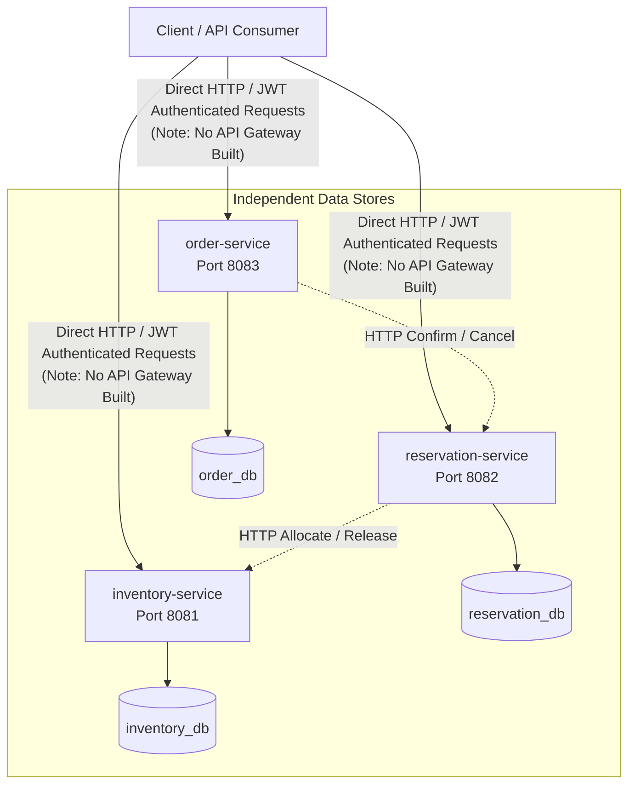
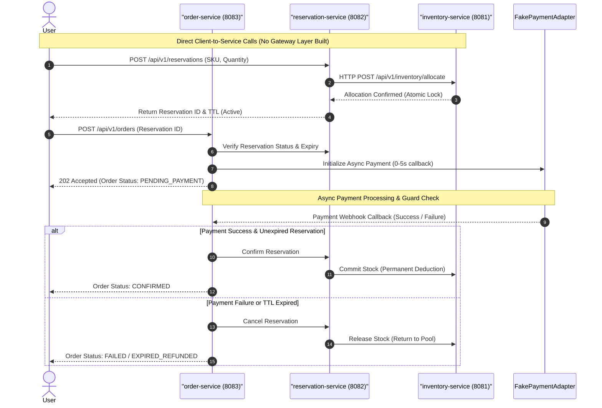

# Architecture, Concurrency, and Testing Documentation

## 1. System Architecture & Topology

The application follows a strictly decoupled microservice architecture. Each service owns its database instance and communicates via explicit HTTP protocols with strict boundaries (e.g., `inventory-service` is the sole source of truth for stock).

> **Note:** As specified in the requirements, an **API Gateway was not built** for this implementation. Clients call each microservice directly. If a gateway layer is assumed to exist in production topologies, it sits upstream of these services, but all JWT verification and routing happen natively within each service for this submission.

### Service Ports & Databases
* **`inventory-service`** (`Port 8081`): Manages SKUs, warehouse inventories, and atomic allocations. Backed by `inventory_db`.
* **`reservation-service`** (`Port 8082`): Manages temporary stock holds with TTL windows and idempotency keys. Backed by `reservation_db`.
* **`order-service`** (`Port 8083`): Orchestrates orders, coordinates confirmations/cancellations, and runs the asynchronous payment adapter. Backed by `order_db`.
* **`commons`**: Shared library containing stateless JWT public-key validation filters and security configuration.

---

## 2. Request Lifecycle & Concurrency Flow

To prevent overselling during flash sales, the system decouples high-velocity stock locking from asynchronous payment processing using a multi-phase lifecycle.

---

## 3. Concurrency & High-Throughput Strategy

Flash sales generate high contention on limited stock items. The system guarantees correctness via:
1. **Database-Level Isolation:** Stock decrement and allocation queries run inside strict transactional boundaries with pessimistic/optimistic locking controls inside `inventory-service`.
2. **Asynchronous Non-Blocking Webhooks:** Long-running payment flows do not block web server request threads; order checkout states transition via background workers.
3. **Idempotency Enforcement:** `Idempotency-Key` headers on reservation requests prevent duplicate network retries from triggering double-allocations.

---

## 4. Critical Edge Cases Handled

* **The Expiry vs. Late Payment Race Condition:** If a user’s payment succeeds right at the edge of their TTL window (or a webhook arrives late), the `order-service` performs an atomic state check against the `reservation-service` before confirming. If the reservation has already expired, the system rejects the late confirmation, transitions the order to `EXPIRED_REFUNDED`, and prevents silent overselling.
* **Service Downtime Recovery:** In-memory context loss during crashes is mitigated by separating TTL background workers in `reservation-service` to systematically sweep and release abandoned expired holds.

---

## 5. OpenAPI Available

Interactive API documentation powered by OpenAPI / Springdoc is available for each microservice to inspect endpoints, request schemas, and header requirements:
* **Inventory Service Swagger UI:** `http://localhost:8081/swagger-ui/index.html`
* **Reservation Service Swagger UI:** `http://localhost:8082/swagger-ui/index.html`
* **Order Service Swagger UI:** `http://localhost:8083/swagger-ui/index.html`

---

## 6. Tests You Believe Prove Correctness

The test suite covers key failure modes and correctness constraints:
* **`StockConcurrencyTest`:** Simulates hundreds of simultaneous multi-threaded requests attempting to reserve the last remaining items in stock under high load, proving that inventory levels **never** drop below zero or permit overselling.
* **`OrderServiceTest`:** Validates the complete asynchronous payment lifecycle, ensuring clean state transitions from `PENDING_PAYMENT` to `CONFIRMED`, and proving that expired reservations resulting in late payment callbacks are safely intercepted, compensated, and automatically refunded.